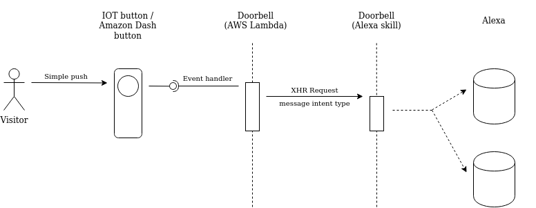

# Doorbell

## Introduction

This project is a way to use IOT button to communicate with Alexa like as a doorbell

## Prerequisites

* An Amazon developper account (required for managing skills and login with Amazon LWA)
* An Alexa enabled device associated to your account
* An AWS account (for managing lambda)

## Installation

First, install [ASK CLI](https://developer.amazon.com/fr-FR/docs/alexa/smapi/quick-start-alexa-skills-kit-command-line-interface.html) and deploy the skill to your Alexa developper account

## Usage

## Technical schema

**Diagram.net link**

https://app.diagrams.net/#G1l5yIitg1NbGZEqSB4hyoNtQxvMHbtTqo
